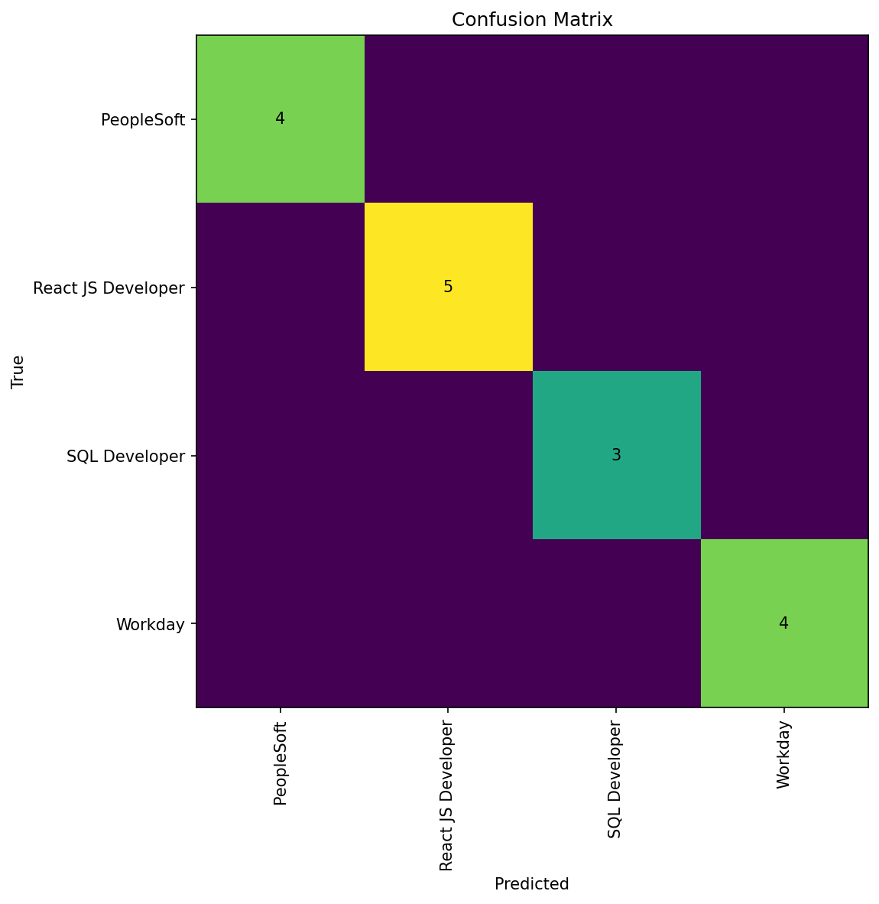
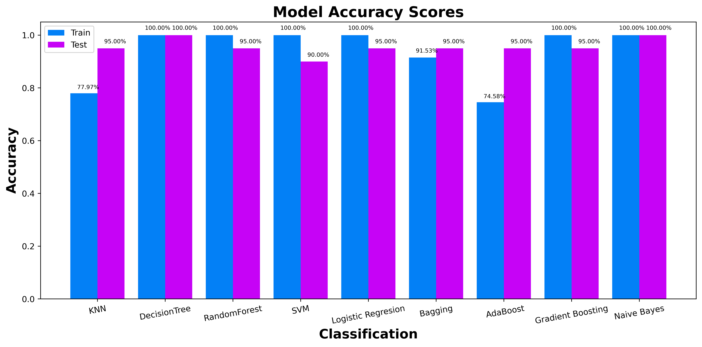

# 📄 Resume Classification (NLP) 🧠

A reproducible **NLP + Machine Learning** project that classifies resumes into job categories using text features.

✅ End-to-end pipeline: **build dataset → train → evaluate**  
📦 Saved model artifact: `models/model.joblib`  
📊 Metrics + reports: `reports/metrics.json`, `reports/classification_report.txt`  
🖼️ Evaluation plots: `reports/figures/confusion_matrix.png`

---

## ✨ Stickers (Badges)


---

## 🎯 Problem
Given the text content of a resume, predict its category (e.g., Data Science, HR, DevOps, etc.).

This is a **multi-class text classification** task.

---

## 📌 Dataset
This repo supports two ways to work with the data:

### Option A (Recommended): Use cleaned CSV (fast & reproducible)
- Input: `data/raw/Cleaned_Resumes.csv`
- Expected columns:
  - `Category`
  - `Resume_Details`

The script `src/make_dataset.py` generates:
- `data/processed/dataset.csv`

### Option B (Optional): Raw resume files (PDF/DOCX)
Raw resumes can be stored in:
- `data/raw/Resumes/`
- `data/raw/Convert Resumes/`

> For the interview/portfolio version, training from the cleaned CSV is the most reproducible option.

---

## 🗂️ Project Structure
```

.
├── src/
│   ├── make_dataset.py     # prepare processed dataset
│   ├── train.py            # train + save best model
│   ├── evaluate.py         # metrics + confusion matrix plot
│   └── predict.py          # CLI inference from raw text
├── data/
│   ├── raw/
│   └── processed/
├── models/
│   └── model.joblib
├── reports/
│   ├── metrics.json
│   ├── classification_report.txt
│   └── figures/
│       └── confusion_matrix.png
│       └──model_accuracy.png
├── notebooks/
└── requirements.txt

````

---

## ⚙️ Setup
Install dependencies:

```bash
pip install -r requirements.txt
````

---

## 🚀 How to Run (End-to-End)

### 1️⃣ Build processed dataset

Creates: `data/processed/dataset.csv`

```bash
python -m src.make_dataset
```

### 2️⃣ Train model

Creates: `models/model.joblib`

```bash
python -m src.train
```

### 3️⃣ Evaluate model + generate plots

Creates:

* `reports/metrics.json`
* `reports/classification_report.txt`
* `reports/figures/confusion_matrix.png`

```bash
python -m src.evaluate
```

---

## 📈 Metrics

Metrics are stored in:

* `reports/metrics.json`

Recommended metrics for multi-class text classification:

* **Macro F1** (important when classes are imbalanced)
* **Accuracy**
* **Macro Precision / Macro Recall**

---

## 🖼️ Output (Evaluation Plot)

### ✅ Confusion Matrix




---

## 🧠 Modeling Notes

* Uses a scikit-learn **Pipeline** to prevent data leakage:

  * **TF-IDF Vectorizer** for text feature extraction
  * A classifier (baseline or best model)
* `train_test_split(..., stratify=y)` is used to preserve class distribution.

---

## 🧪 Inference Demo (Predict)

After training, you can classify a new resume text:

```bash
python -m src.predict --text "Experienced Python developer with ML and NLP projects..."
```

Example output:

```json
{"predicted_category": "Data Science"}
```

---

## 🔍 Next Steps (Improvements)

* Add **K-Fold Cross Validation** for more robust evaluation
* Compare multiple models (LogReg vs LinearSVM vs Naive Bayes) and save results to `reports/model_comparison.csv`
* Add text cleaning + deduplication + label noise checks
* Add interpretability (top TF-IDF terms per class)

---

## 🔒 Privacy Note

Resumes may contain personal information. For a public portfolio:

* Avoid uploading real resumes to GitHub
* Use anonymized or synthetic examples
* Keep sensitive raw files ignored via `.gitignore`

---

## 🧾 License

This project is licensed under the **MIT License** — see the [LICENSE](LICENSE) file for details.


